# PSoC&trade; 4: MSCLP CAPSENSE&trade; low power

This code example demonstrates an implementation of a low-power application including recommended power states and transitions, tuning parameter adjustments, and the method of tuning. This example uses a single self-capacitance-based button in multi sense CAPSENSE&trade; low power (MSCLP - 5th-generation low-power CAPSENSE&trade;) to demonstrate different considerations to implement a low-power design.

This document also explains how to manually tune the self-capacitance-based low-power widget for optimum performance w.r.t parameters such as power consumption and response time using the CSD-RM sensing technique and CAPSENSE&trade; Tuner.

[View this README on GitHub.](https://github.com/Infineon/mtb-example-psoc4-msclp-capsense-low-power)

[Provide feedback on this code example.](https://cypress.co1.qualtrics.com/jfe/form/SV_1NTns53sK2yiljn?Q_EED=eyJVbmlxdWUgRG9jIElkIjoiQ0UyMzUxMTEiLCJTcGVjIE51bWJlciI6IjAwMi0zNTExMSIsIkRvYyBUaXRsZSI6IlBTb0MmdHJhZGU7IDQ6IE1TQ0xQIENBUFNFTlNFJnRyYWRlOyBsb3cgcG93ZXIiLCJyaWQiOiJuYWxsdXNhbXkiLCJEb2MgdmVyc2lvbiI6IjIuMC4wIiwiRG9jIExhbmd1YWdlIjoiRW5nbGlzaCIsIkRvYyBEaXZpc2lvbiI6Ik1DRCIsIkRvYyBCVSI6IklDVyIsIkRvYyBGYW1pbHkiOiJQU09DIn0=)

## Requirements

- [ModusToolbox&trade; software](https://www.infineon.com/modustoolbox) v3.0 or later

  **Note:** This code example version requires ModusToolbox&trade; software version 3.0 and is not backward compatible with v2.4 or older versions.

- Board support package (BSP) minimum required version: 0.5.0
- Programming language: C
- Associated parts: [PSoC&trade; 4000T](www.infineon.com/002-33949)


## Supported toolchains (make variable 'TOOLCHAIN')

- GNU Arm&reg; embedded compiler v10.3.1 (`GCC_ARM`) - Default value of `TOOLCHAIN`
- Arm&reg; compiler v6.13 (`ARM`)
- IAR C/C++ compiler v8.42.2 (`IAR`)


## Supported kits (make variable 'TARGET')

- [PSoC&trade; 4000T CAPSENSE&trade; evaluation kit](https://www.infineon.com/CY8CKIT-040T) (`CY8CKIT-040T`) - Default `TARGET`

## Hardware setup

This example uses the board's default configuration. See the [Kit user guide](www.infineon.com/002-34472) to ensure that the board is configured correctly.

## Software setup

This example requires no additional software or tools.

## Using the code example

Create the project and open it using one of the following:

<details><summary><b>In Eclipse IDE for ModusToolbox&trade; software</b></summary>

1. Click the **New Application** link in the **Quick Panel** (or, use **File** > **New** > **ModusToolbox&trade; Application**). This launches the [Project Creator](https://www.infineon.com/ModusToolboxProjectCreator) tool.

2. Pick a kit supported by the code example from the list shown in the **Project Creator - Choose Board Support Package (BSP)** dialog.

   When you select a supported kit, the example is reconfigured automatically to work with the kit. To work with a different supported kit later, use the [Library Manager](https://www.infineon.com/ModusToolboxLibraryManager) to choose the BSP for the supported kit. You can use the Library Manager to select or update the BSP and firmware libraries used in this application. To access the Library Manager, click the link from the **Quick Panel**.

   You can also just start the application creation process again and select a different kit.

   If you want to use the application for a kit not listed here, you may need to update the source files. If the kit does not have the required resources, the application may not work.

3. In the **Project Creator - Select Application** dialog, choose the example by enabling the checkbox.

4. (Optional) Change the suggested **New Application Name**.

5. The **Application(s) Root Path** defaults to the Eclipse workspace which is usually the desired location for the application. If you want to store the application in a different location, you can change the *Application(s) Root Path* value. Applications that share libraries should be in the same root path.

6. Click **Create** to complete the application creation process.

For more details, see the [Eclipse IDE for ModusToolbox&trade; software user guide](https://www.infineon.com/MTBEclipseIDEUserGuide) (locally available at *{ModusToolbox&trade; software install directory}/docs_{version}/mt_ide_user_guide.pdf*).

</details>

<details><summary><b>In command-line interface (CLI)</b></summary>

ModusToolbox&trade; software provides the Project Creator as both a GUI tool and the command line tool, "project-creator-cli". The CLI tool can be used to create applications from a CLI terminal or from within batch files or shell scripts. This tool is available in the *{ModusToolbox&trade; software install directory}/tools_{version}/project-creator/* directory.

Use a CLI terminal to invoke the "project-creator-cli" tool. On Windows, use the command line "modus-shell" program provided in the ModusToolbox&trade; software installation instead of a standard Windows command-line application. This shell provides access to all ModusToolbox&trade; software tools. You can access it by typing `modus-shell` in the search box in the Windows menu. In Linux and macOS, you can use any terminal application.

The "project-creator-cli" tool has the following arguments:

Argument | Description | Required/optional
---------|-------------|-----------
`--board-id` | Defined in the `<id>` field of the [BSP](https://github.com/Infineon?q=bsp-manifest&type=&language=&sort=) manifest | Required
`--app-id`   | Defined in the `<id>` field of the [CE](https://github.com/Infineon?q=ce-manifest&type=&language=&sort=) manifest | Required
`--target-dir`| Specify the directory in which the application is to be created if you prefer not to use the default current working directory | Optional
`--user-app-name`| Specify the name of the application if you prefer to have a name other than the example's default name | Optional

<br>

The following example clones the "[PSoC&trade; 4: MSCLP CAPSENSE&trade; low power](https://github.com/Infineon/mtb-example-psoc4-msclp-capsense-low-power)" application with the desired name "CAPSENSE_Low_Power" configured for the *CY8CKIT-040T* BSP into the specified working directory, *C:/mtb_projects*:

   ```
   project-creator-cli --board-id CY8CKIT-040T --app-id mtb-example-psoc4-msclp-capsense-low-power --user-app-name CAPSENSE_Low_Power --target-dir "C:/mtb_projects"
   ```

**Note:** The project-creator-cli tool uses the `git clone` and `make getlibs` commands to fetch the repository and import the required libraries. For details, see the "Project creator tools" section of the [ModusToolbox&trade; software user guide](https://www.infineon.com/ModusToolboxUserGuide) (locally available at *{ModusToolbox&trade; software install directory}/docs_{version}/mtb_user_guide.pdf*).

To work with a different supported kit later, use the [Library Manager](https://www.infineon.com/ModusToolboxLibraryManager) to choose the BSP for the supported kit. You can invoke the Library Manager GUI tool from the terminal using `make library-manager` command or use the Library Manager CLI tool "library-manager-cli" to change the BSP.

The "library-manager-cli" tool has the following arguments:

Argument | Description | Required/optional
---------|-------------|-----------
`--add-bsp-name` | Name of the BSP that should be added to the application | Required
`--set-active-bsp` | Name of the BSP that should be as active BSP for the application | Required
`--add-bsp-version`| Specify the version of the BSP that should be added to the application if you do not wish to use the latest from manifest | Optional
`--add-bsp-location`| Specify the location of the BSP (local/shared) if you prefer to add the BSP in a shared path | Optional

<br>

Following example adds the CY8CKIT-040T BSP to the already created application and makes it the active BSP for the app:

   ```
   library-manager-cli --project "C:/mtb_projects/CAPSENSE_Low_Power" --add-bsp-name CY8CKIT-040T --add-bsp-version "latest-v4.X" --add-bsp-location "local"

   library-manager-cli --project "C:/mtb_projects/CAPSENSE_Low_Power" --set-active-bsp APP_CY8CKIT-040T
   ```

</details>

<details><summary><b>In third-party IDEs</b></summary>

Use one of the following options:

- **Use the standalone [Project Creator](https://www.infineon.com/ModusToolboxProjectCreator) tool:**

   1. Launch Project Creator from the Windows Start menu or from *{ModusToolbox&trade; software install directory}/tools_{version}/project-creator/project-creator.exe*.

   2. In the initial **Choose Board Support Package** screen, select the BSP, and click **Next**.

   3. In the **Select Application** screen, select the appropriate IDE from the **Target IDE** drop-down menu.

   4. Click **Create** and follow the instructions printed in the bottom pane to import or open the exported project in the respective IDE.

<br>

- **Use command-line interface (CLI):**

   1. Follow the instructions from the **In command-line interface (CLI)** section to create the application, and then import the libraries using the `make getlibs` command.

   2. Export the application to a supported IDE using the `make <ide>` command.

   3. Follow the instructions displayed in the terminal to create or import the application as an IDE project.

For a list of supported IDEs and more details, see the "Exporting to IDEs" section of the [ModusToolbox&trade; software user guide](https://www.infineon.com/ModusToolboxUserGuide) (locally available at *{ModusToolbox&trade; software install directory}/docs_{version}/mtb_user_guide.pdf*).

</details>

The project has the necessary settings by default, so you can go to [Operation](#operation) to test the example. If you want to understand the tuning process and follow the stages for this kit or your own board, go to the [Tuning procedure](#tuning-procedure) and then test it using [Operation](#operation).

## Operation

1. Connect the USB cable between the [CY8CKIT-040T kit](https://www.infineon.com/CY8CKIT-040T) and the PC as follows:

   **Figure 1. Connecting the CY8CKIT-040T kit with the PC**

   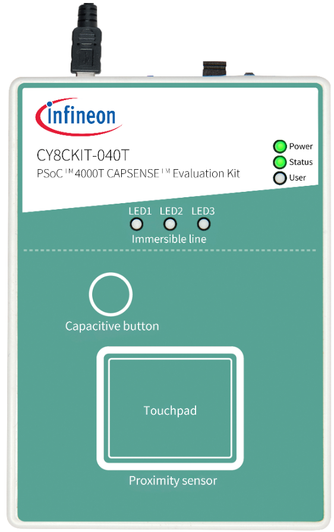

2. The SWD, User LED, and I2C modes are multiplexed to the same pins (GPIO pins P3[2] and P3[3]) in CY8CKIT-040T. The interface can be switched between these using FW-loader commands. Download and unzip the *Batch_files_for_mux_selection* zipped file from the Beta package to the *bin* folder inside the *fw-loader* folder in the ModusToolbox&trade; installation directory.

   Default location: */ModusToolbox/tools_3.0/fw-loader/bin*

   Select the SWD mode by running the *Select_SWD* batch file to program the CY8CKIT-040T kit. For detailed information, see Section 2.3.1 in the [CY8CKIT-040T kit user guide](www.infineon.com/002-34870).

3. Program the board using one of the following:

   <details><summary><b>Using Eclipse IDE for ModusToolbox&trade; software</b></summary>

      1. Select the application project in the Project Explorer.

      2. In the **Quick Panel**, scroll down, and click **\<Application Name> Program (KitProg3_MiniProg4)**.
      </details>

   <details><summary><b>Using CLI</b></summary>

     From the terminal, execute the `make program` command to build and program the application using the default toolchain to the default target. The default toolchain is specified in the application's Makefile but you can override this value manually:
      ```
      make program TARGET=<BSP> TOOLCHAIN=<toolchain>
      ```

      Example:
      ```
      make program TARGET=CY8CKIT-040T TOOLCHAIN=GCC_ARM
      ```
   </details>

4. After programming, the application starts automatically.

5. To test the application, see the LED2 state change with respect to different low-power states based on the user interaction. Place your finger over the CAPSENSE&trade; button and notice that LED1 turns ON when touched, and turns OFF when the finger is lifted.

   **Table 1. LED2 state for different application power modes**

    Power mode state  | LED2 
   :---------------------| :-----
    Active  | Red
    Active Low Refresh rate <br>(ALR)  | Yellow
    Wake on Touch <br>(WoT) | Green

6. Verify that the application is transitioning to different power modes based on user input conditions as follows:

   **Figure 2. Low-power mode state machine**

   

### Monitor data using CAPSENSE&trade; Tuner

1. Select the I2C mode by running the *Select_I2C* batch file to enable the I2C communication between onboard KitProg and CAPSENSE&trade; Tuner.

2. Open CAPSENSE&trade; Tuner from the 'Tools' section in the IDE Quick Panel.

   You can also run the CAPSENSE&trade; Tuner application standalone from *{ModusToolbox&trade; install directory}/ModusToolbox/tools_{version}/capsense-configurator/capsense-tuner*. In this case, after opening the application, select **File** > **Open** and open the *design.cycapsense* file of the respective application, which is present in the *{Application root directory}/bsps/TARGET_APP_\<BSP-NAME>/config* folder.

   See the [ModusToolbox&trade; user guide](https://www.infineon.com/ModusToolboxUserGuide) (locally available at *ModusToolbox install directory}/docs_{version}/mtb_user_guide.pdf*)for options to open the CAPSENSE&trade; tuner application using the CLI.

3. Ensure that the kit is in CMSIS-DAP Bulk mode (KitProg3 Status LED is ON and not blinking). See [Firmware-loader](https://github.com/Infineon/Firmware-loader) to learn how to update the firmware and switch modes in KitProg3.

4. In the tuner application, click on the **Tuner communication setup** icon or select **Tools** > **Tuner communication setup**. In the window that appears, select the I2C checkbox under KitProg3 and configure it as follows:

   - I2C address: 8
   - Sub-address: 2 bytes
   - Speed (kHz): 400

   These are the same values set in the EZI2C resource.

   **Figure 3. Tuner communication setup parameters**

   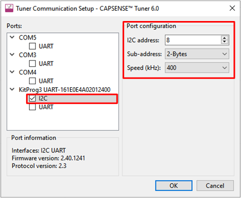

5. Click **Connect** or select **Communication** > **Connect** to establish a connection.

   **Figure 4. Establish connection**

   

6. Click **Start** or select **Communication** > **Start** to start data streaming from the device.

   **Figure 5. Start tuner communication**

   

   The *Widget/Sensor Parameters* tab is updated with the parameters configured in the *CAPSENSE&trade; Configurator* window. The tuner displays the data from the sensor in the **Widget View** and **Graph View** tabs.

7. Set the **Read mode** to Synchronized mode. Navigate to the **Widget view** tab and notice that the **Button0** widget is highlighted in blue when you touch it.

   **Figure 6. Widget view of the CAPSENSE&trade; Tuner**

   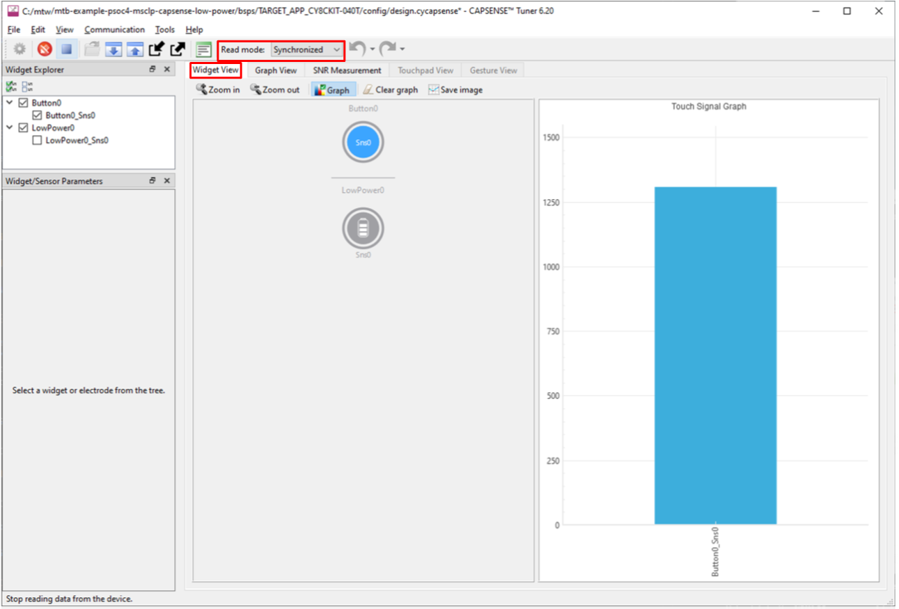

8. Go to the **Graph View** tab to view the raw count, baseline, difference count, and status for each sensor. Observe that the low-power widget sensor (**LowPower0_Sns0**) raw count is plotted once the device completes the full frame scan (or detects a touch) in **WOT** mode and moved to **Active/ALR** mode.

   **Figure 7. Graph view of the CAPSENSE&trade; Tuner**

   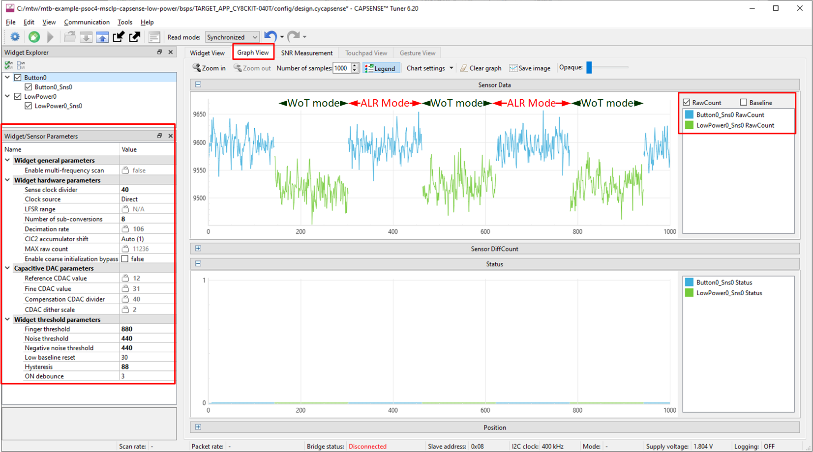

9. Observe the **Widget/Sensor parameters** section in the CAPSENSE&trade; Tuner window as shown in Figure 7.

10. Switch to the **SNR Measurement** tab for measuring the SNR and verify that the SNR is above 5:1 and the Signal count is above 50; select **Button0** and **Button0_Sns0** sensor, and then click **Acquire noise** as follows:

    **Figure 8. CAPSENSE&trade; Tuner - SNR measurement: acquire noise**

    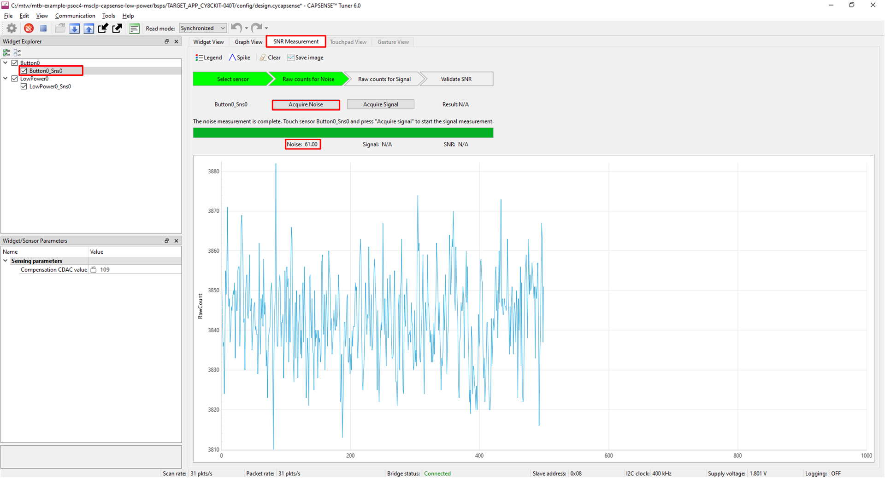

      **Note:** Because the scan refresh rate is lower in **ALR** mode, it takes more time to acquire noise. Touch the CAPSENSE&trade; button before clicking **Acquire noise** to transition the device to **ACTIVE** mode to get the signal faster.

11. Once the noise is acquired, place the metal finger (6 mm is used in this example) at a position on the button and then click **Acquire signal**. Ensure that the metal finger remains on the button as long as the signal acquisition is in progress. Observe the SNR is above 5:1 and the Signal count is above 50.

    The calculated SNR on this button is displayed, as Figure 9 shows. Based on your end system design, test the signal with a finger that matches the size of your normal use case. Typically, finger size targets are 4 mm to 8 mm. Consider testing with smaller sizes that should be rejected by the system to ensure that they do not reach the finger threshold.

    **Figure 9. CAPSENSE&trade; Tuner - SNR measurement: acquire signal**

    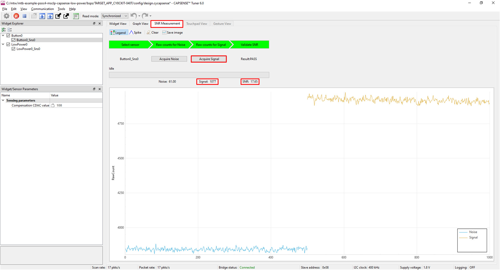

12. To measure the SNR of the low-power sensor (**LowPower0_Sns0**), set the **Finger threshold** to max (65535) in **Widget/Sensor Parameters** as shown in Figure 10 for both **Button0** and **LowPower0** widgets. This is required to stop detecting a touch in low-power mode and ALR mode and to avoid state transitions to Active mode from both low-power mode and ALR mode.

      **Figure 10. CAPSENSE&trade; update finger threshold**

      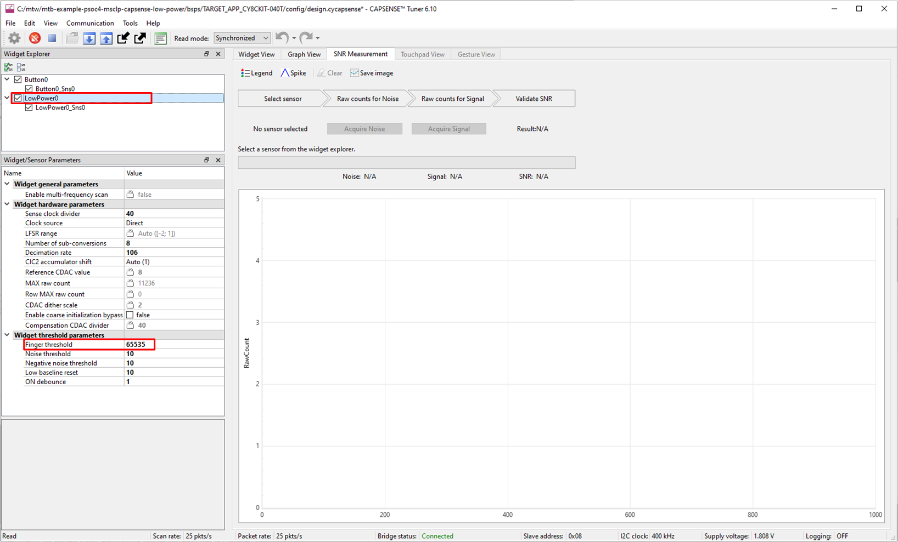

13. Repeat Steps 10 and 11 to observe the SNR and signal as Figure 11 shows.

       **Figure 11. CAPSENSE&trade; Tuner - SNR measurement: low-power widget**

       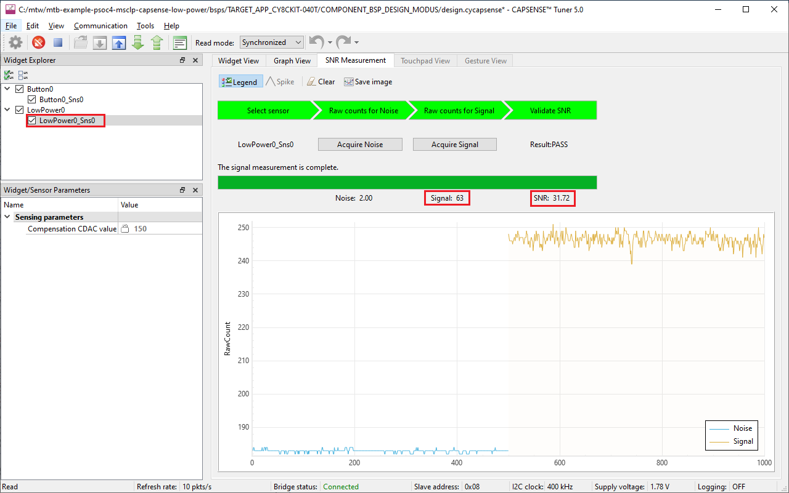


### Measure current at different power modes

1. Disable the serial LED function and tuner to measure the current used for CAPSENSE&trade; sensing in each power mode.

   Disable the `ENABLE_SPI_SERIAL_LED` and `ENABLE_TUNER` macros in *main.c* as follows:

    ```
      #define ENABLE_SPI_SERIAL_LED            (0u)

      #define ENABLE_TUNER                     (0u)
    ```

2. Run the *Select_No_Connection* batch file, to completely disconnect the MCU from the onboard KitProg.

3. Connect an ammeter to evaluate the low-power feature of the device as follows:

   **Figure 12. Current measurement setup**

   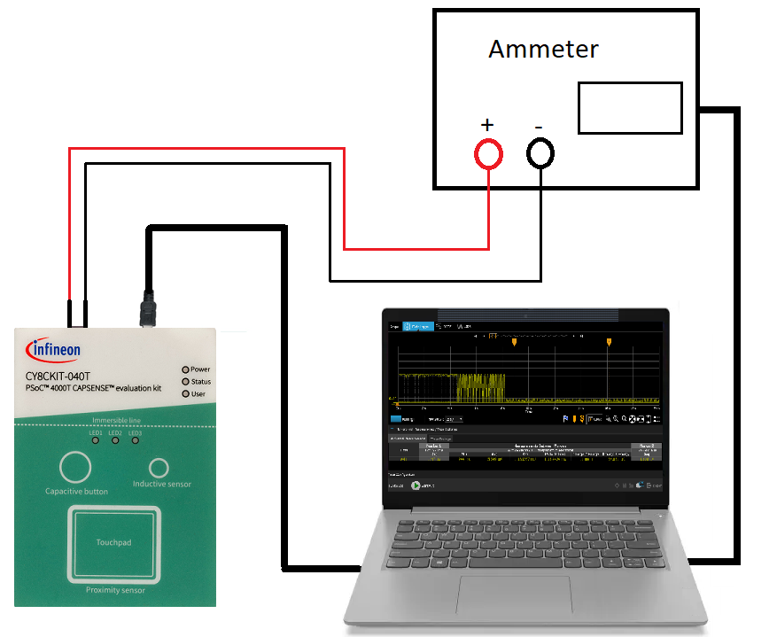

4. After reset, the application transitions to low-power states if there is no user activity, i.e., no button touch detection, to reduce the power consumption as follows:

   **Figure 13. Power mode transition - no user activity**

   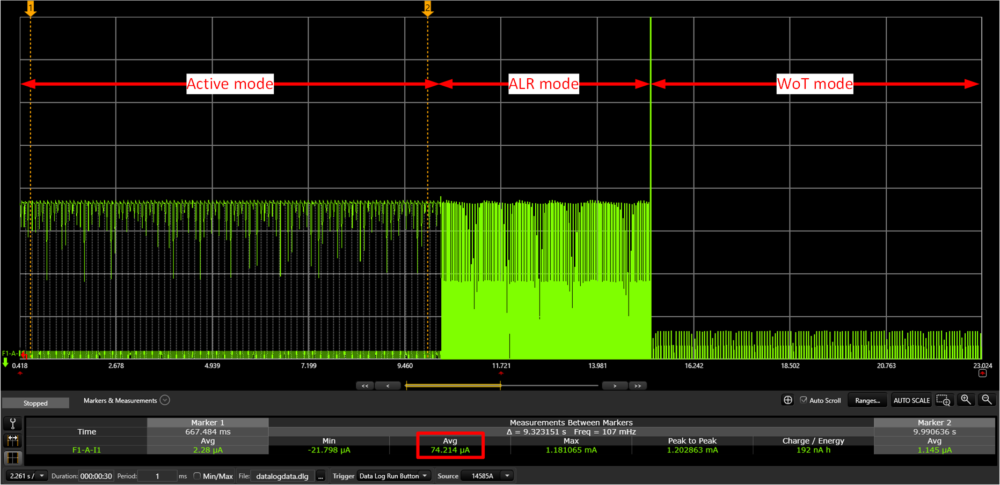

5. If there is touch detection while in low-power states, the application transitions to active mode with the highest refresh rate as follows:

   **Figure 14. Power mode transition - touch detection**

   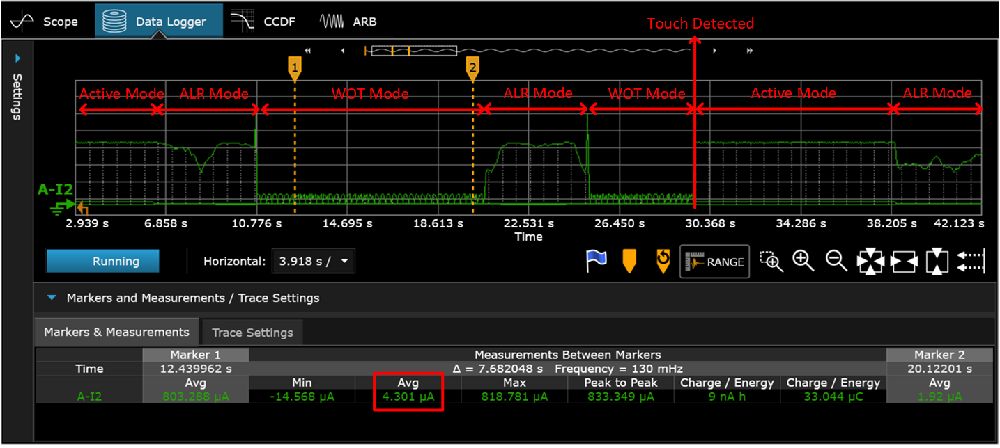

   **Table 2. Measured current for different modes**

    Power mode  | LED2 State |Refresh rate(Hz) | Current consumption (µA)
   :---------------------| :-----|:-----:|:-----:
    Active  | RED |128 |74
    Active Low Refresh rate <br>(ALR)  | YELLOW |32 |20
    Wake on Touch <br>(WoT) | GREEN  |16 |3.6
Note : 
<br>
Measured WoT current, with the kit having Deep Sleep current of 1.7µA. Expected ~4.4µA if the kit has typical Deep Sleep current of 2.5µA.
<br>

## Tuning procedure

### Create custom BSP for your board

1. Create a custom BSP for your board having any device, by following the steps given in [ModusToolbox™ BSP Assistant user guide](https://www.infineon.com/dgdl/Infineon-ModusToolbox_BSP_Assistant_1.0_User_Guide-UserManual-v02_00-EN.pdf?fileId=8ac78c8c8386267f0183a972f45c59af). In this code example, it is created for the device "CY8C4046LQI-T452".

2. Open the *design.modus* file from *{Application root directory}/bsps/TARGET_APP_\<BSP-NAME>/config* folder obtained in the previous step and enable CAPSENSE&trade; to get *design.cycapsense* file. CAPSENSE&trade; configuration can then be started from scratch as follows.

### Tuning flow

The following steps explain the tuning procedure for low-power widgets; for tuning regular widgets, see [PSoC&trade; 4: MSCLP self-capacitance button tuning](https://github.com/Infineon/mtb-example-psoc4-msclp-self-capacitance-button).

**Note:** See the section "Selecting CAPSENSE&trade; hardware parameters" in the [PSoC&trade; 4 and PSoC&trade; 6 MCU CAPSENSE&trade; design guide](https://www.infineon.com/AN85951) to learn about the considerations for selecting each parameter value. In addition, see the "Low-Power widget parameters" section in the [Achieving lowest power capacitive sensing with PSoC&trade; 4000T](https://www.infineon.com/002-34231) to learn about the considerations for parameter values specific to low-power widgets.


**Figure 15. Low-power widget tuning flow**

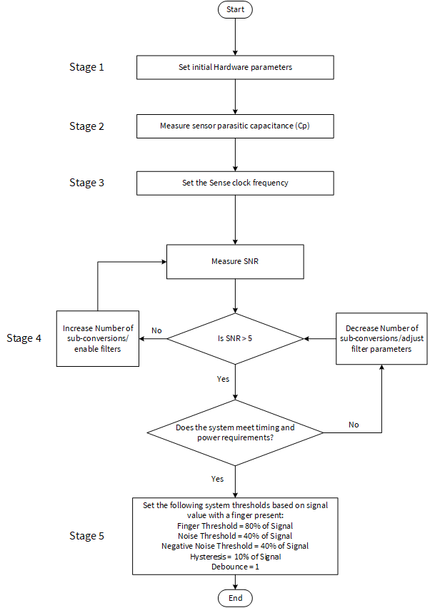

Do the following to tune the button widget:

- [Stage 1: Set the initial hardware parameters](#stage-1-set-the-initial-hardware-parameters)

- [Stage 2: Set the sense clock frequency](#stage-2-set-the-sense-clock-frequency)

- [Stage 3: Fine tune for required SNR, power, and refresh rate](#stage-3-fine-tune-for-required-snr-power-and-refresh-rate)

- [Stage 4: CDAC Dither parameter settings](#stage-4-cdac-dither-parameter-settings)

- [Stage 5: Tune threshold parameters](#stage-5-tune-threshold-parameters)


### Stage 1: Set the initial hardware parameters
-------------

1. Connect the board to your PC using the provided USB cable through the KitProg3 USB connector.

2. Launch the Device Configurator tool.

   You can launch the Device Configurator in Eclipse IDE for ModusToolbox&trade; from the Tools section in the IDE Quick Panel or stand-alone mode from *{ModusToolbox&trade; install directory}/ModusToolbox/tools_{version}/device-configurator/device-configurator*. In this case, after opening the application, select **File** > **Open** and open the *design.modus* file of the respective application, which is present in the *{Application root directory}/bsps/TARGET_APP_\<BSP-NAME>/config* folder.

3. Enable the CAPSENSE&trade; channel in Device Configurator as follows:

   **Figure 16. Enable CAPSENSE&trade; in Device Configurator**

   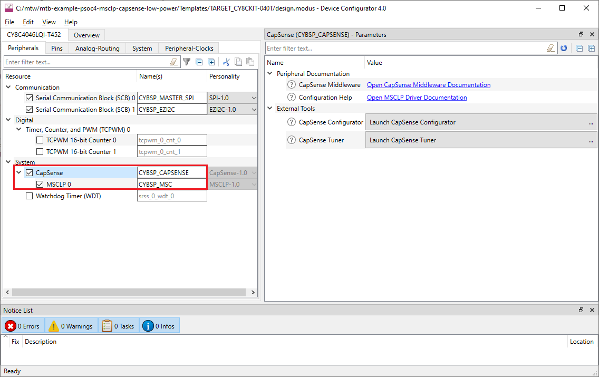

   Save the changes and close the window.

4. Launch the CAPSENSE&trade; Configurator tool.

   You can launch the CAPSENSE&trade; Configurator tool in Eclipse IDE for ModusToolbox&trade; from the "CAPSENSE&trade;" peripheral setting in the Device Configurator or directly from the Tools section in the IDE Quick Panel.

   You can also launch it in stand-alone mode from *{ModusToolbox&trade; install directory}/ModusToolbox/tools_{version}/capsense-configurator/capsense-configurator*. In this case, after opening the application, select **File** > **Open** and open the *design.cycapsense* file of the respective application, which is present in the *{Application root directory}/bsps/TARGET_APP_\<BSP-NAME>/config* folder.

   See the [ModusToolbox&trade; CAPSENSE&trade; Configurator tool guide](https://www.infineon.com/ModusToolboxCapSenseConfig) for step-by-step instructions on how to configure and launch CAPSENSE&trade; in ModusToolbox&trade;.

5. In the **Basic** tab, configure a Button widget 'Button0' and a low-power widget 'LowPower0' as a CSD RM (self-cap) and set the CSD tuning mode as *Manual tuning*.

   **Figure 17. CAPSENSE&trade; Configurator - Basic tab**

   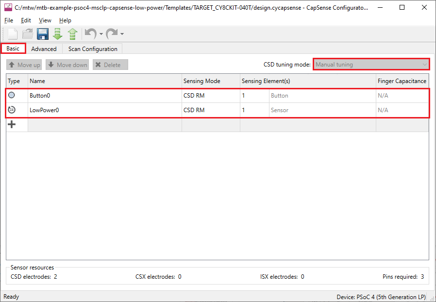

6. Do the following in the **General** tab under the **Advanced** tab:

   1. Select **CAPSENSE&trade; IMO Clock frequency** as **46 MHz**.

   2. Set the **Modulator clock divider** to **1** to obtain the maximum available modulator clock frequency as recommended in the [CAPSENSE&trade; design guide](https://www.cypress.com/AN85951).

   3. Set the **Number of init sub-conversions** based on the hint shown when you hover over the edit box. Retain the default value (will be set in [Stage 2: Set the sense clock frequency](#stage-2-set-the-sense-clock-frequency))

   4. Use **Wake-on-Touch settings** to set the refresh rate and frame timeout while in the lowest power mode (Wake-on-Touch mode).

   5. Set **Wake-on-Touch scan interval (us)** based on the required low-power state scan refresh rate. For example, to get a 16-Hz refresh rate, set the value to **62500**.

   6. Set the **Number of frames in Wake-on-Touch** as the maximum number of frames to be scanned in WoT mode if there is no touch detected. This determines the maximum time the device will be kept in the lowest-power mode if there is no user activity. The maximum time can be calculated by multiplying this parameter with the **Wake-on-Touch scan interval (us)** value.

      For example, to get 10 seconds as the maximum time in WoT mode, set the **Number of frames in Wake-on-Touch** to **160** for the  scan interval set as 62500 us.

      **Note:** For tuning low-power widgets, the **Number of frames in Wake-on-Touch** must be less than the  **Maximum number of raw counts in SRAM** based on the number of sensors in WoT mode as follows:

      **Table 3. Maximum number of Raw counts in SRAM**

      Number of low <br> power widgets  | Maximum number of <br> raw counts in SRAM
       :---------------------| :-----
         1  | 245
         2  | 117
         3  | 74
         4  | 53
         5  | 40
         6  | 31
         7  | 25
         8  | 21

   7. Retain the default settings for all regular and low-power widget filters. You can enable or update the filters later depending on the signal-to-noise ratio (SNR) requirements in [Stage 3: Fine tune for required SNR, power, and refresh rate](#stage-3-fine-tune-for-required-snr-power-and-refresh-rate).

      Filters are used to reduce the peak-to-peak noise. Using filters will result in a higher scan time.

      **Figure 18. CAPSENSE&trade; Configurator - General settings**

      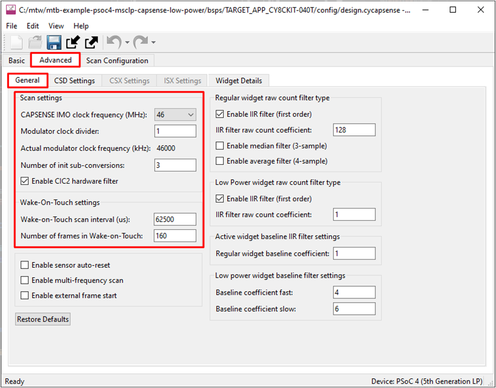

      **Note:** Each tab has a **Restore Defaults** button to restore the parameters of that tab to their default values.

7. Go to the **CSD settings** tab and make the following changes:

   1. Set **Inactive sensor connection** as **Shield**.
   2. Set **Shield mode** as **Active**.
   3. Set **Total shield count** as **13**.
   
      Recommended to configure all unused sensor pins as shield. This will help to improve noise immunity.

   4. Select **Enable CDAC auto-calibration** and **Enable compensation CDAC**.

      This helps in achieving the required CDAC calibration levels (85% of maximum count) for all sensors in the widget while maintaining the same sensitivity across the sensor elements.

   5. Select **Enable CDAC dither**.

      This helps in removing flat-spots, by adding white noise that moves the conversion point around the flat-spots region. Recomandations are explained in [Stage 4: CDAC Dither parameter settings](#stage-4-cdac-dither-parameter-settings).

      **Figure 19. CAPSENSE&trade; Configurator - Advanced CSD settings**

      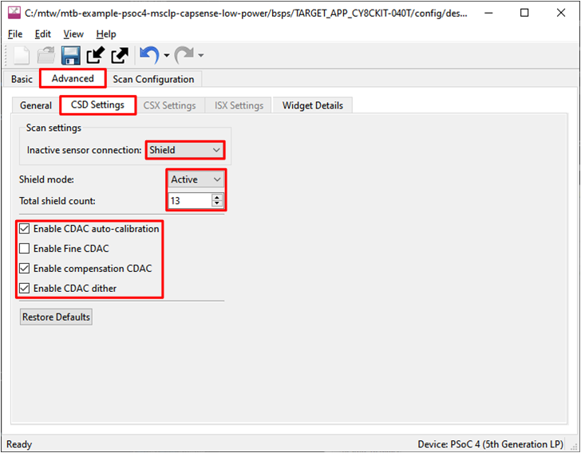

8. Go to the **Widget details** tab. Select **LowPower0** from the left pane, and then set the following:

   - **Sense clock divider:** Retain the default value (will be set in [Stage 2: Set the sense clock frequency](#stage-2-set-the-sense-clock-frequency))

   - **Clock source:** Direct

      **Note:** Spread spectrum clock (SSC) or PRS clock can be used as a clock source to deal with EMI/EMC issues.

   - **Number of sub-conversions: 60**

     60 is a good starting point to ensure a fast scan time and sufficient signal. This value will be adjusted as required in [Stage 3: Fine tune for required SNR, power, and refresh rate](#stage-3-fine-tune-for-required-snr-power-and-refresh-rate).

   - **Finger Threshold:** 65535

      Finger threshold is set to maximum to avoid waking up the device from WoT mode due to touch detection; this is required to find the signal and SNR. Change the Finger threshold of **Button0** as well to **65535**.

   - **Noise Threshold:** 10

   - **Negative Noise Threshold:** 10

   - **Low baseline reset:** 10

   - **ON debounce:** 1

     These values reduce the influence of the baseline on the sensor signal, which helps to get the true difference count. Retain the default values for all other threshold parameters; these parameters are set in [Stage 5: Tune threshold parameters](#stage-5-tune-threshold-parameters).

      **Figure 20. CAPSENSE&trade; Configurator - Widget details tab under the Advanced tab**

     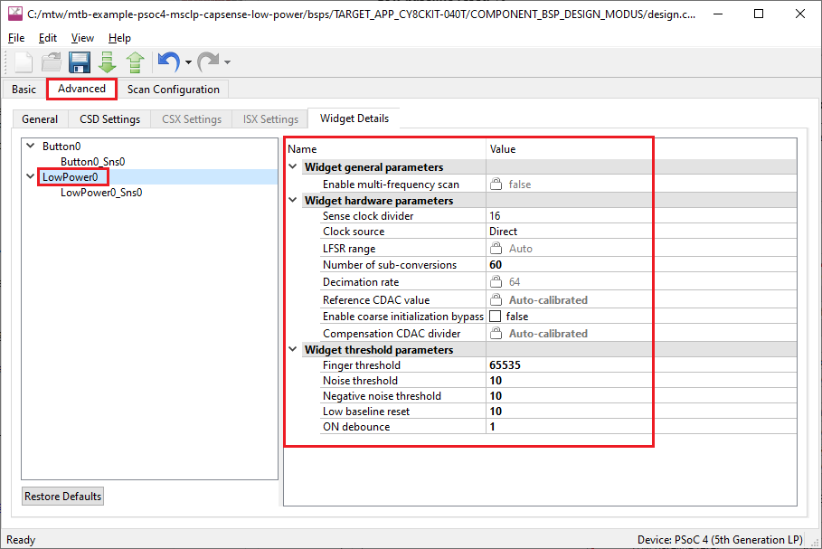

9. Go to the **Scan Configuration** tab to select the pins and the scan slots. Do the following:

   1. Configure pins for the electrodes using the drop-down menu.

   2. Configure the scan slots using the **Auto-assign slots** option. The other option is to allot each sensor a scan slot based on the entered slot number.

   3. Check the notice list for warnings or errors.

      **Figure 21. Scan Configuration tab**

      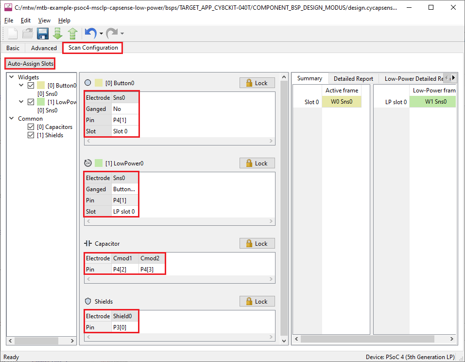

10. Click **Save** to apply the settings.

### Stage 2: Set the sense clock frequency
------------------
The maximum frequency set should charge and discharge the sensor completely, which is verified using an oscilloscope and an active probe. To view the charging and discharging waveforms of the sensor, probe at the sensors (or as close as possible to the sensors), and not at the pins or resistor. See **Figure 22** and **Figure 23** for more deatils. You can also use a passive probe which will add an additional parasitic capacitance of around 15 pF, therefore the tuning may be not optimal. These figures show the signals observed on shield.

**Figure 22**  shows proper charging when sense clock frequency is correctly tuned i.e., the voltage is settling to the required voltage at the end of each phase.**Figure 23** shows incomplete settling (charging/discharing) and hence the **sense clock divider is set to 28** as shown in **Figure 22**.

 **Notes:** 
   - If you are explicitly using the PRS or SSCx clock source to lower electromagnetic interference, ensure that you select the sense clock frequency that meets the conditions mentioned in the [ModusToolbox&trade; CAPSENSE&trade; configurator guide](https://www.infineon.com/dgdl/Infineon-ModusToolbox_CapSense_Configurator_Guide_(Version_2.0)-Software-v01_00-EN.pdf?fileId=8ac78c8c7e7124d1017ed9999c3b364d&utm_source=cypress) in addition to the above conditions. PRS and SSCx techniques spread the frequency across a range.

   - Actual sense clock frequency value is chosen such that the divider is **divisible by 4** to have all four scan phases for equal durations. 

The project uses max sense clock frequency by default. If an incomplete charging/discharging is observed (see **Figure 23**), the sense clock divider is increased until the sensor and shield is fully charged/discharged.
For tuning your board, ensure to charge/dischage by probing at both the sensor and shield.


**Figure 22. Proper charge cycle of a sensor**

   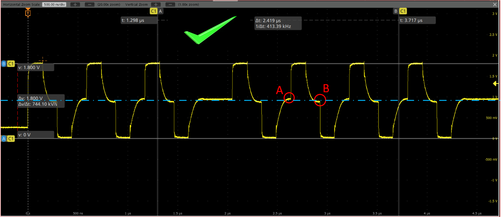

   **Figure 23. Improper charge cycle of a sensor**

   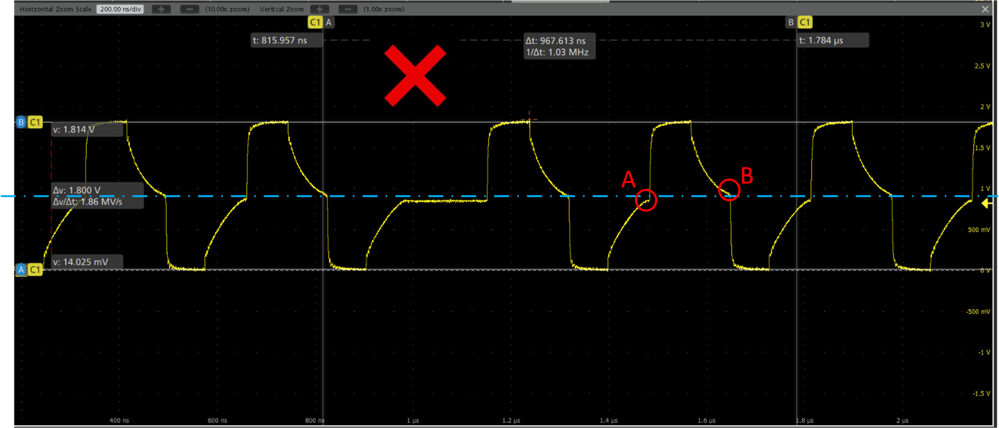
   
Observe Point A and B marked in **Figure 22**, it is charging/discharging properly to VDD/2 whereas in **Figure 23**, it is not reaching to VDD/2.
  

   Set the final value in the CAPSENSE&trade; configurator using the steps given in **Step 8** of **Stage 1**, which ensures the maximum possible sense clock frequency (for good gain) while allowing the sensor capacitance to fully charge and discharge in each phase of the MSCLP CSD sensing method.

Program the board and fine-tune the sense clock frequency as follows:

   1. Check the calibration **PASS** or **FAIL** status from the return value of the `Cy_CapSense_Enable()` function. `CY_ASSERT(0)` assertion (which halts the CPU) can be invoked if the return value is not equal to `CY_CAPSENSE_STATUS_SUCCESS`. 

   2. Launch the CAPSENSE&trade; tuner to monitor the CAPSENSE&trade; data and for CAPSENSE&trade; parameter tuning.
   
      See the [CAPSENSE&trade; tuner guide](https://www.infineon.com/ModusToolboxCapsenseTuner) for step-by-step instructions on how to launch and use the CAPSENSE&trade; tuner in ModusToolbox&trade;.

      **Figure 24** shows the signal nearly saturates at 85% calibration, because of its thin overlay (~1.5 mm) and large button dimension (10 mm) for CY8CKIT-040T. Therefore, the auto-calibration percent is changed to 70% via the `Cy_CapSense_SetCalibrationTarget()` API in the **main.c** file to avoid signal saturation.

      **Figure 24. Signal saturation at 85% calibration**

      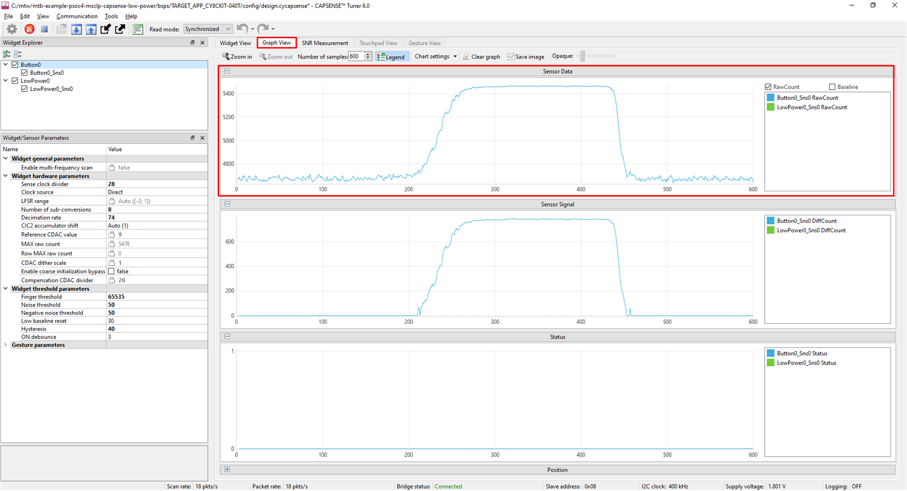

      **Note:** Skip this change in calibration percent on your setup if you do not notice saturation in signal (i.e., rawcount reaches maxCount when touched) while calculating SNR in **Step 1** of **Stage 4**. See the [AN234231 – Achieving lowest-power capacitive sensing with PSoC&trade; 4000T](https://www.infineon.com/002-34231) to calculate the value of maxCount.

Ensure that the following condition is satisfied for the selected sense clock frequency:

**Note:** Calibration may **FAIL** if the obtained raw counts is not within the targeted range. 

- The auto-calibrated reference CDAC value should be above (20/compensation CDAC divider). Verify this once the initial hardware parameters are loaded into the device.

- Click **Button0** in the **Widget Explorer** to view the Reference CDAC value in the sensor parameters window.
- Additionally, click each sensor element. For example, **Button0_Sns0** in the **Widget Explorer** to view the compensation CDAC in the sensor parameters window. 

See the [CAPSENSE&trade; design guide](https://www.infineon.com/an85951) for the recommended guidelines on valid CDAC range (with and without compensation) to result in calibration PASS across multiple boards because of board-to-board variations.


**Figure 25. Widget Explorer**

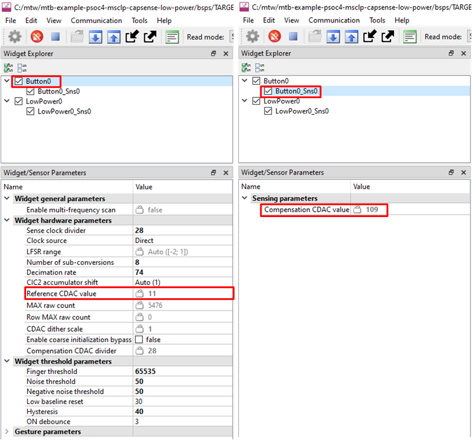

   4. If the above condition is not satisfied. Fine-tune the sense clock divider to bring the CDAC value within the range.

      1. If the reference CDAC value is not in the recommended range, increase or decrease the sense clock divider in the widget hardware parameters window.

      **Note:** From the raw count equation (see [AN234231 – Achieving lowest-power capacitive sensing with PSoC&trade; 4000T](https://www.infineon.com/002-34231)), it is evident that increasing the sense clock divider will decrease the reference CDAC value for a given calibration percent and vice versa.

      2. Click **To device** to apply the changes to the device, as shown in **Figure 26**.

         **Figure 26. Apply changes to device**

         
         
      3. Click each sensor element, for instance, **Button_0** in the Widget Explorer.

      4. Observe the Reference CDAC value in the **Sensing parameters** section of the Widget parameters window.

      5. Repeat **Steps 1** to **Step 4** until the reference CDAC value is above (20/compensation CDAC divider).

   5. If the CDAC value is still not in the required range based on fine tuning the sense clock divider, consider reducing the modulator clock frequency to 24 MHz. The sense clock frequency is derived from modulator clock frequency. Therefore, the corresponding sense clock divider values must be updated.

   6. Actual sense clock frequency value is chosen such that the divider is divisible by 4 to have all four scan phases for equal durations.

   7. Capture the raw counts of each sensor (see **Figure 27**) and verify that they are approximately (±5%) equal to 70% of the MaxCount. See [AN234231 – Achieving lowest-power capacitive sensing with PSoC&trade; 4000T](https://www.infineon.com/002-34231) for the MaxCount equation.

      **Figure 27. Verifying raw count calibration level**

      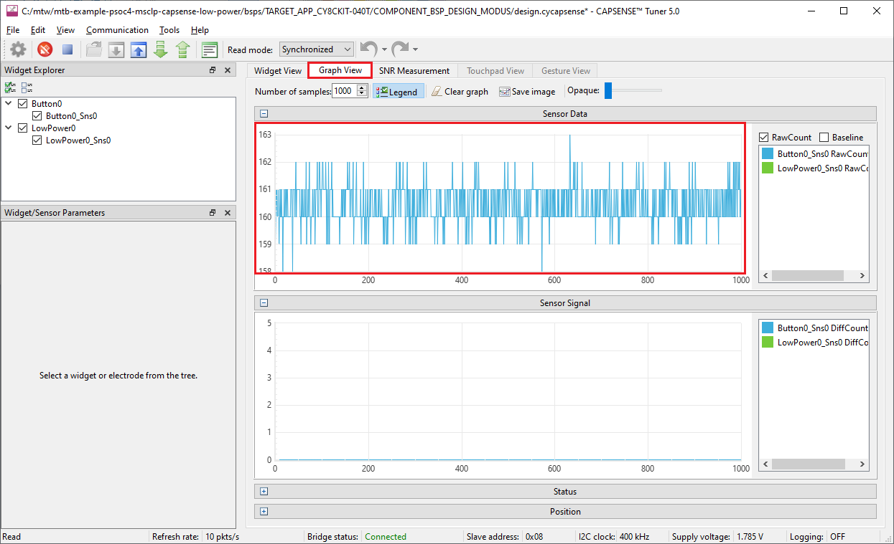

   **Note:** 

   **Figure 25** shows, the CDAC values are in the recommended range. You can leave the sense clock divider to the value as shown in **Step 2** of **Stage 3**.


### Stage 3: Fine-tune for required SNR, power, and refresh rate
-----------------------

1. Measure the SNR as mentioned in the [Operation](#operation) section and perform sensor tuning until the minimum SNR of 5:1 and a signal count of at least 50 are achieved.

2. Update the number of sub-conversions.

   Do the following to update the number of sub-conversions:

   1. Update the number of sub-conversions (N<sub>sub</sub>) directly in the **Widget/Sensor parameters** tab of the CAPSENSE&trade; Tuner.

   2. CY8CKIT-040T has a built-in CIC2 filter which increases the resolution for the same scan time. See [AN234231 - Achieving lowest-power capacitive sensing with PSoC&trade; 4000T](https://www.infineon.com/002-34231) for detailed information on the CIC2 filter.

   3. The current consumption is directly proportional to the number of sub-conversion; therefore, decrease the number of sub-conversions to achieve a lower current consumption.

      **Note:** Number of sub-conversion should be greater than or equal to 4.

   4. Calculate the decimation rate using **Equation 3**. The resolution increases with an increase in the decimation rate; therefore, set the maximum decimation rate achieved.

      **Equation 3. Decimation rate**

      

   5. Load the parameters to the device and measure SNR as mentioned in Steps 10 and 11 in the [Operation](#operation) section. Perform tuning until the minimum SNR of 5:1 and at least a signal count at least greater than 50 are achieved.

   6. Skip this step if the following conditions are met:

      - Measured SNR from the previous stage is greater than 5:1.

      - Signal count is greater than 50.

      - Each power mode has the least current/power consumption.

   If your system is very noisy (counts >20), do the following to enable filters:

   1. Open **CAPSENSE&trade; Configurator** from ModusToolbox&trade; Quick Panel and select the appropriate filter:

      **Figure 28. Filter settings in CAPSENSE&trade; Configurator**

      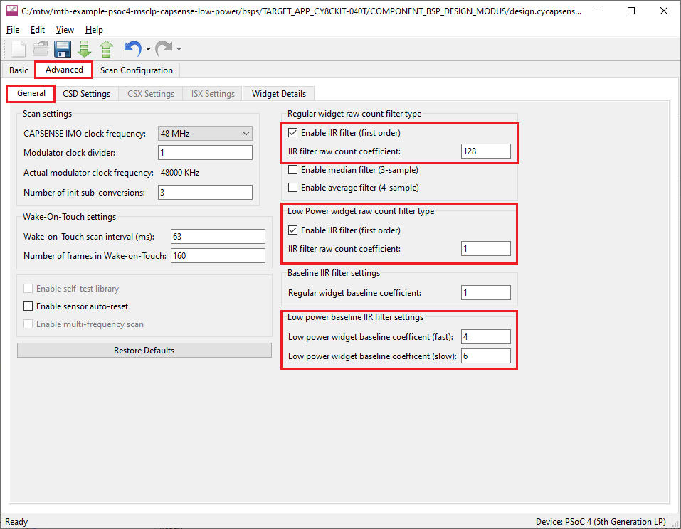

      **Note:**
      - Add the filter based on the type of noise in your measurements. See [ModusToolbox&trade; CAPSENSE&trade; configurator guide](https://www.infineon.com/002-24372) for more details.
      - The current example has an in-built CIC2 filter, therefore, it is recommended to enable the IIR filter.

   2. Reprogram the device to update the filter settings.

### Stage 4: CDAC Dither parameter settings
--------------------

MSCLP uses CDAC dithering to reduce flat spots. The optimal polynomial and other parameters depend on number of sub-conversions (N<sub>sub</sub>).

The following macros hold the recommended dither parameters for this low-power code example in **main.c**,
```
#define	CDAC_DITHER_SCALE          1u

#define	CDAC_DITHER_SEED           15u

#define	CDAC_DITHER_POLY           9u
```

See the following table for general recommended values of Dither paraeters based on N<sub>sub</sub> selection.

 **Table 4.  General recommendations of Dither parameters**

N<sub>sub</sub> Range | CDAC_Dither_poly| CDAC_Dither_Seed |  CDAC_Dither_scale
:---: | :---: | :---: | :---: 
8 to 12 | 9 | 15 | 1
13 to 15 | 9 | 15 | 0
16 to 23 | 18 | 31 | 1
24 to 31 | 18 | 31 | 0
32 to 41 | 33 | 63 | 1
42 to 63 | 33 | 63 | 0
64 to 84 | 65 | 127 | 1
85 to 127 | 65 | 127 | 0
128 to 174 | 142 | 255 | 1
175 to 255 | 142 | 255 | 0
\>255 | 142 | 255 | 0


### Stage 5: Tune threshold parameters
--------------------

The software threshold is set for each widget based on the diff counts. Do the following in CAPSENSE&trade; Tuner to set up the threshold for a widget:

1. Switch to the **Graph View** tab and select **Button0**.

2. Touch the sensor and monitor the touch signal in the **Sensor signal** graph, as Figure 24 shows. Place the metal finger at all possible positions and use the least signal for setting the software threshold. In addition, ensure that the metal finger is grounded.

   **Figure 29. Sensor signal when the sensor is touched**

   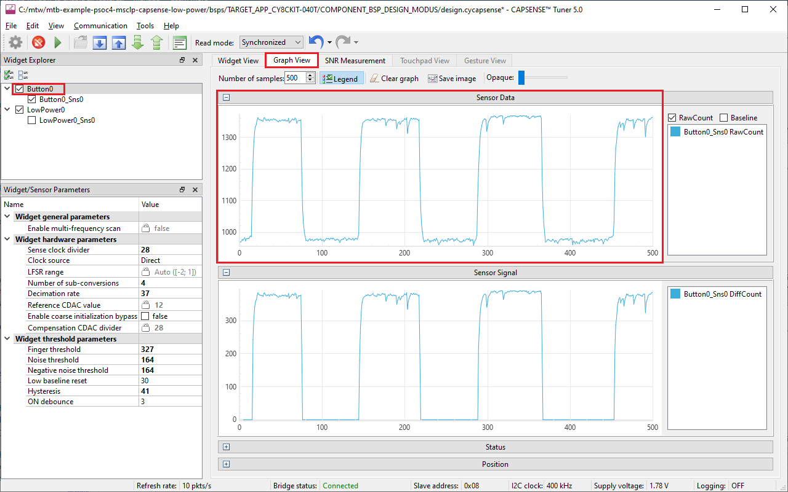

3. For the **LowPower0_Sns0** low power sensor, switch to the **SNR Measurement** tab and follow Steps 10 and 11 in the [Monitor data using CAPSENSE&trade; Tuner](#monitor-data-using-capsensetrade-tuner) section.

4. When the signal is measured, set the thresholds according to the following recommendations:

   - Finger threshold = 80 percent of the signal

   - Noise threshold = 40 percent of the signal

   - Negative noise threshold = 40 percent of the signal

   - Debounce = 1

5. Set the threshold parameters in the **Widget/Sensor parameters** section of the CAPSENSE&trade; Tuner:

   **Figure 30. Widget threshold parameters**

   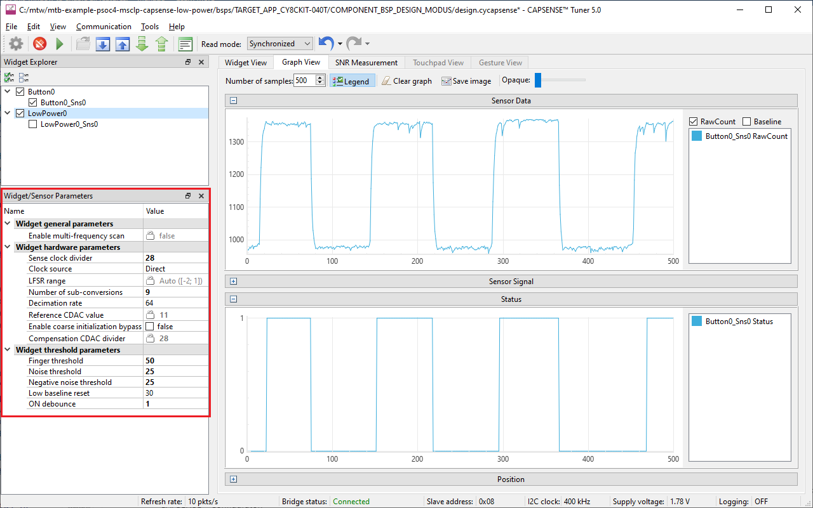

6. Apply the settings to the device and the project by clicking **Apply to Device** and then **Apply to Project** as Figure 26 shows, and close the tuner. The change is updated in the *design.cycapsense* file and reflected in the CAPSENSE&trade; Configurator.

   **Figure 31. Apply to project setting**

   

7. Consider testing with metal fingers with smaller sizes that should be rejected by the system to ensure that they do not reach the finger threshold.

   If your sensor is tuned correctly, you will observe the touch status go from 0 to 1 in the **Status** sub-window of the **Graph View** window as Figure 27 shows. The successful tuning of the button is also indicated by the LED1 in the kit; the LED1 is turned ON when the finger touches the button and turned OFF when the finger is removed.

   **Figure 32. Sensor status in CAPSENSE&trade; Tuner**

   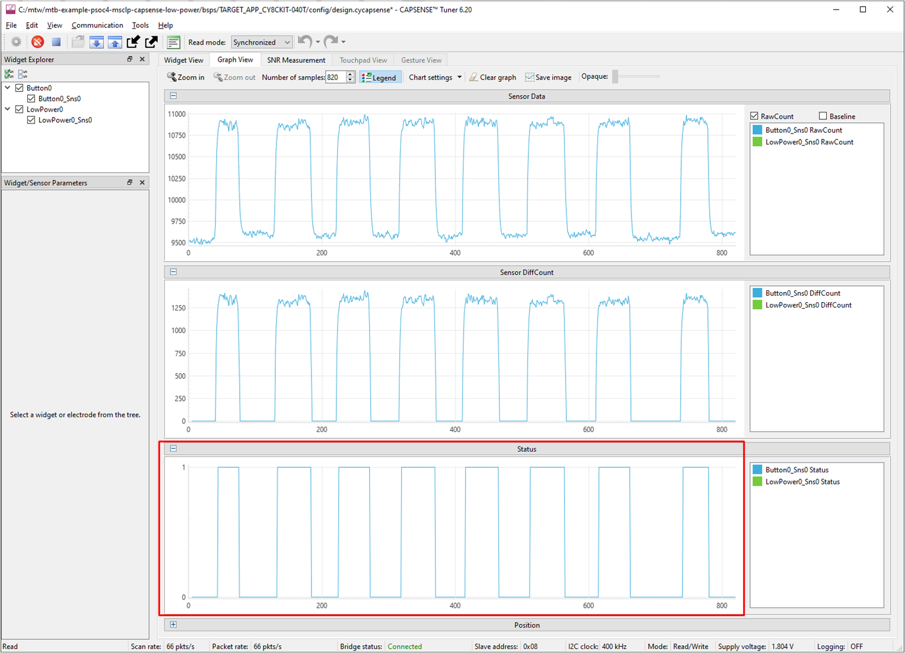

8. Close the CAPSENSE&trade; Tuner and launch **CAPSENSE&trade; Configurator**. You should now see all the changes that you made in the CAPSENSE&trade; Tuner reflected in the **CAPSENSE&trade; Configurator**.

   **Table 5. Software tuning parameters obtained based on sense for CY8CKIT-040T**

   Parameter|	 Button0|	 LowPower0
   :--------|:------|:------
   Signal	| 1077 |1059
   Finger threshold 	| 860 |850
   Noise threshold |430|425
   Negative noise threshold	|430 |425
   Low baseline reset	| 30 |30
   Hysteresis	| 40 |NA
   ON debounce	| 3|1


## Debugging

You can debug this project to step through the code. In the IDE, use the **\<Application Name> Debug (KitProg3_MiniProg4)** configuration in the **Quick Panel**. For details, see the "Program and debug" section in the [Eclipse IDE for ModusToolbox&trade; software user guide](https://www.infineon.com/MTBEclipseIDEUserGuide).

**Note:** The debug port is disabled by default for CY8CKIT-040T, because it uses the pins P3[2] (SWDIO) and P3[3] (SWDCK) for I2C SDA and SCL. If debugging is required, do the following:
   1. Enable the **Debug Mode** under the **Systems** tab in the **Device Configurator** and change the **Debug Mode** setting to **SWD**.
   2. Disable I2C in the project by disabling the **Serial Communication Block (SCB)** resource with **EZI2C** personality in the **Peripherals Tab** in the **Device Configurator**.
   3. Select the pins P3[2] (SWDIO) and P3[3] (SWDCK) under the **SWD pin** setting.
   4. Select the drive mode of both the pins as "Strong Drive,Input buffer on" under the **Pins** tab in the **Device Configurator**.
   5. Enable the **SWD_DEBUG_ENABLE** macro present in the *main.c* file as follows: *#define SWD_DEBUG_ENABLE (1u)*. See **Step 4** in **Section 2.3** of the kit guide for more details.

## Design and implementation

The project contains one button configured as a regular and low-power widget in CSD-RM sensing mode. See the [Tuning procedure](#tuning-procedure) section for step-by-step instructions to configure other settings of the **CAPSENSE&trade; Configurator**.

There are two LEDs used in this project. LED1 shows the button touch status: it turns ON when touched and turns OFF when the finger is lifted. LED2 shows the current low-power state of the application. See the following table for the LED2 response based on the low-power state.

**Table 6. LED2 state for different application power mode**

   Power mode state  | LED2 
   :---------------------| :-----
   Active  | Red
   Active Low Refresh rate <br>(ALR)  | Yellow
   Wake on Touch <br>(WoT) | Green

There are three power states defined for this project:

- **ACTIVE** mode

- Active Low Refresh rate (**ALR**) mode

- Wake On Touch (**WoT**) mode

After reset, the device is in **ACTIVE** mode, and scans the regular CAPSENSE&trade; widgets with a high refresh rate (**128 Hz**). If user activity is detected in any other mode, the device is transferred to **ACTIVE** mode to provide the best user interface experience. This mode has the highest power consumption; therefore, your design should reduce the time spent in **ACTIVE** mode as much as possible.

If there is no user activity for a certain time (`ACTIVE_MODE_TIMEOUT_SEC` = 10 seconds), the application transitions to **ALR** mode. Here, the refresh rate is reduced to **32 Hz**; this mode acts as an intermediate state before moving to the lowest-power mode (**WoT** mode). This mode can also be used for periodically updating baselines of sensors while there is no user activity for a long time.

Further non-activity for a certain time (`ALR_MODE_TIMEOUT_SEC` = 5 seconds) transitions the application to the lowest-power mode - **Wake-on-Touch** mode, which scans the low-power widget at a low refresh rate (**16 Hz**) and processes the results without CPU intervention.

**Note:** An internal low-power timer (MSCLP timer) is available in CAPSENSE&trade; MSCLP hardware to set the refresh rate for each power mode as follows:
- For **ACTIVE** and **ALR** modes: Use the `Cy_CapSense_ConfigureMsclpTimer()` function.
- For **WoT** mode: Use the **Wake-on-Touch scan interval** in CAPSENSE&trade; Configurator.

Different power modes and transition conditions for a typical use case are as follows:

   **Figure 33. State machine showing different power states of the device**

   


The project uses the [CAPSENSE&trade; middleware](https://github.com/Infineon/capsense) (see ModusToolbox&trade; user guide for more details on selecting a middleware). See [AN85951 – PSoC&trade; 4 and PSoC&trade; 6 MCU CAPSENSE&trade; design guide](https://www.infineon.com/dgdl/Infineon-AN85951_PSoC_4_and_PSoC_6_MCU_CapSense_Design_Guide-ApplicationNotes-v27_00-EN.pdf?fileId=8ac78c8c7cdc391c017d0723535d4661&utm_source=cypress&utm_medium=referral&utm_campaign=202110_globe_en_all_integration-application_note) for more details on CAPSENSE&trade; features and usage.

The [ModusToolbox&trade; software](https://www.infineon.com/modustoolbox) provides a GUI-based tuner application for debugging and tuning the CAPSENSE&trade; system. The CAPSENSE&trade; Tuner application works with EZI2C and UART communication interfaces. This project has an SCB block configured in EZI2C mode to establish communication with the onboard KitProg, which in turn enables reading the CAPSENSE&trade; raw data by the CAPSENSE&trade; Tuner. See [EZI2C Peripheral settings](#resources-and-settings).

The CAPSENSE&trade; data structure that contains the CAPSENSE&trade; raw data is exposed to the CAPSENSE&trade; Tuner by setting up the I2C communication data buffer with the CAPSENSE&trade; data structure. This enables the tuner to access the CAPSENSE&trade; raw data for tuning and debugging CAPSENSE&trade;.

The successful tuning of the button is indicated by an LED in the CY8CKIT-040T kit: the LED is turned ON when the finger touches the button and turned OFF when the finger is removed from the button.


### Set up the VDDA supply voltage and debug mode in Device Configurator

1. Open Device Configurator from the Quick Panel.

2. Go to the **System** tab. Select the **Power** resource, and set the VDDA value under **Operating conditions** as follows:

   **Figure 34. Setting the VDDA supply in system tab of Device Configurator**

   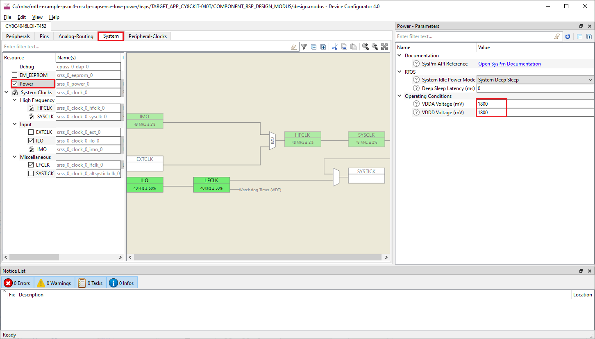
<br>
3. By default, SWD pins are active in all device power modes. Disable debug mode to disable SWD pins and thereby reduce the power consumption as follows:

   **Figure 35. Disable Debug mode in the System tab of Device Configurator**

   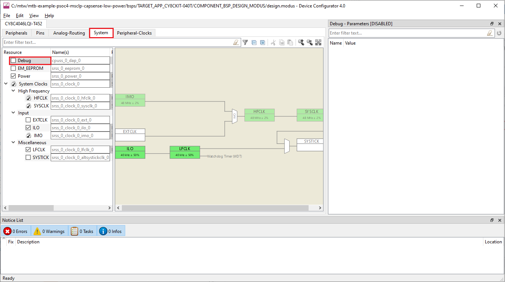


<br>

## Resources and settings
<br>

**Figure 36. EZI2C settings**

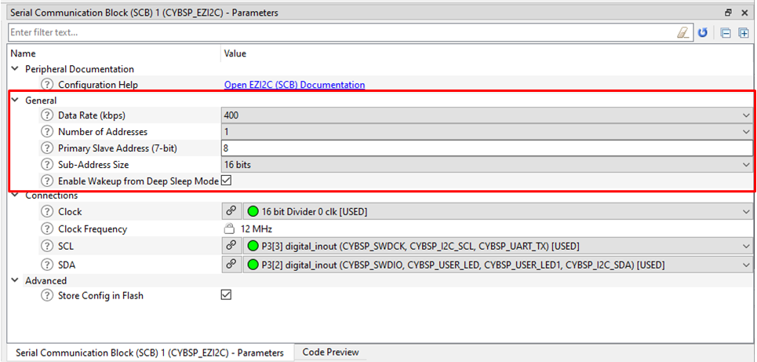
<br>

**Figure 37. SPI settings**

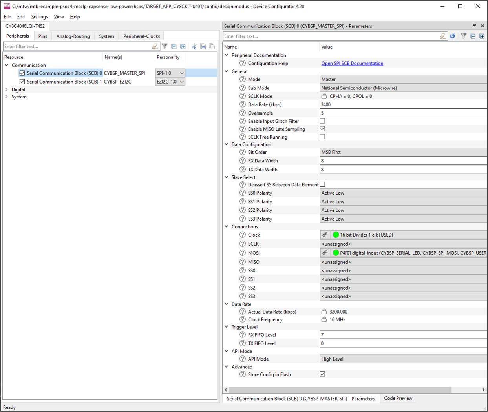
<br>

**Table 7. Application resources**

 Resource  |  Alias/object     |    Purpose
 :------- | :------------    | :------------
 SCB (I2C) (PDL) | CYBSP_EZI2C          | EZI2C slave driver to communicate with CAPSENSE&trade; Tuner
 SCB (SPI) (PDL) | CYBSP_MASTER_SPI          | SPI master driver to control serial LEDs
 CAPSENSE&trade; | CYBSP_MSC | CAPSENSE&trade; driver to interact with the MSC hardware and interface the CAPSENSE&trade; sensors
 Digital pin | CYBSP_SERIAL_LED | To show the button operation and power mode states

</details>

<br>

## Firmware flow
<br>

**Figure 38. Firmware flowchart**


<br>

## Related resources

Resources  | Links
-----------|----------------------------------
Application notes  | [AN79953](https://www.infineon.com/AN79953) – Getting started with PSoC&trade; 4 <br>  [AN85951](https://www.infineon.com/AN85951) – PSoC&trade; 4 and PSoC&trade; 6 MCU CAPSENSE&trade; design guide <br>  [AN234231](https://www.infineon.com/AN234231) – Achieving lowest-power capacitive sensing with PSoC&trade; 4000T
Code examples  | [Using ModusToolbox&trade; software](https://github.com/Infineon/Code-Examples-for-ModusToolbox-Software) on GitHub
Device documentation |  [PSoC&trade; 4 datasheets](https://www.infineon.com/cms/en/search.html?intc=searchkwr-return#!view=downloads&term=psoc%204&doc_group=Data%20Sheet) <br>[PSoC&trade; 4 technical reference manuals](https://www.infineon.com/cms/en/search.html#!term=psoc%204%20technical%20reference%20manual&view=all)
Development kits | Select your kits from the [evaluation board finder](https://www.infineon.com/cms/en/design-support/finder-selection-tools/product-finder/evaluation-board) page.
Libraries on GitHub  | [mtb-pdl-cat2](https://github.com/Infineon/mtb-pdl-cat2) –  PSoC&trade; 4 Peripheral driver library (PDL) <br>  [mtb-hal-cat2](https://github.com/Infineon/mtb-hal-cat2)  – Hardware abstraction layer (HAL) library
Middleware on GitHub  | [capsense](https://github.com/Infineon/capsense) – CAPSENSE&trade; library and documents
Tools | [Eclipse IDE for ModusToolbox&trade; software](https://www.infineon.com/modustoolbox) –  ModusToolbox&trade; software is a collection of easy-to-use software and tools enabling rapid development with Infineon MCUs, covering applications from embedded sense and control to wireless and cloud-connected systems using AIROC&trade; Wi-Fi and Bluetooth® connectivity devices.
<br>

## Other resources

Infineon provides a wealth of data at www.infineon.com to help you select the right device, and quickly and effectively integrate it into your design.

## Document history


Document title: *CE235111* – *PSoC&trade; 4: MSCLP CAPSENSE&trade; low power*

 Version | Description of change
 ------- | ---------------------
 1.0.0   | New code example
 1.0.1   | Minor readme update
 2.0.0   | Major update to support ModusToolbox&trade; v3.0. This version is not backward compatible with previous versions of ModusToolbox&trade; software.


---------------------------------------------------------

© Cypress Semiconductor Corporation, 2022-2023. This document is the property of Cypress Semiconductor Corporation, an Infineon Technologies company, and its affiliates ("Cypress").  This document, including any software or firmware included or referenced in this document ("Software"), is owned by Cypress under the intellectual property laws and treaties of the United States and other countries worldwide.  Cypress reserves all rights under such laws and treaties and does not, except as specifically stated in this paragraph, grant any license under its patents, copyrights, trademarks, or other intellectual property rights.  If the Software is not accompanied by a license agreement and you do not otherwise have a written agreement with Cypress governing the use of the Software, then Cypress hereby grants you a personal, non-exclusive, nontransferable license (without the right to sublicense) (1) under its copyright rights in the Software (a) for Software provided in source code form, to modify and reproduce the Software solely for use with Cypress hardware products, only internally within your organization, and (b) to distribute the Software in binary code form externally to end users (either directly or indirectly through resellers and distributors), solely for use on Cypress hardware product units, and (2) under those claims of Cypress’s patents that are infringed by the Software (as provided by Cypress, unmodified) to make, use, distribute, and import the Software solely for use with Cypress hardware products.  Any other use, reproduction, modification, translation, or compilation of the Software is prohibited.
<br>
TO THE EXTENT PERMITTED BY APPLICABLE LAW, CYPRESS MAKES NO WARRANTY OF ANY KIND, EXPRESS OR IMPLIED, WITH REGARD TO THIS DOCUMENT OR ANY SOFTWARE OR ACCOMPANYING HARDWARE, INCLUDING, BUT NOT LIMITED TO, THE IMPLIED WARRANTIES OF MERCHANTABILITY AND FITNESS FOR A PARTICULAR PURPOSE.  No computing device can be absolutely secure.  Therefore, despite security measures implemented in Cypress hardware or software products, Cypress shall have no liability arising out of any security breach, such as unauthorized access to or use of a Cypress product. CYPRESS DOES NOT REPRESENT, WARRANT, OR GUARANTEE THAT CYPRESS PRODUCTS, OR SYSTEMS CREATED USING CYPRESS PRODUCTS, WILL BE FREE FROM CORRUPTION, ATTACK, VIRUSES, INTERFERENCE, HACKING, DATA LOSS OR THEFT, OR OTHER SECURITY INTRUSION (collectively, "Security Breach").  Cypress disclaims any liability relating to any Security Breach, and you shall and hereby do release Cypress from any claim, damage, or other liability arising from any Security Breach.  In addition, the products described in these materials may contain design defects or errors known as errata which may cause the product to deviate from published specifications. To the extent permitted by applicable law, Cypress reserves the right to make changes to this document without further notice. Cypress does not assume any liability arising out of the application or use of any product or circuit described in this document. Any information provided in this document, including any sample design information or programming code, is provided only for reference purposes.  It is the responsibility of the user of this document to properly design, program, and test the functionality and safety of any application made of this information and any resulting product.  "High-Risk Device" means any device or system whose failure could cause personal injury, death, or property damage.  Examples of High-Risk Devices are weapons, nuclear installations, surgical implants, and other medical devices.  "Critical Component" means any component of a High-Risk Device whose failure to perform can be reasonably expected to cause, directly or indirectly, the failure of the High-Risk Device, or to affect its safety or effectiveness.  Cypress is not liable, in whole or in part, and you shall and hereby do release Cypress from any claim, damage, or other liability arising from any use of a Cypress product as a Critical Component in a High-Risk Device. You shall indemnify and hold Cypress, including its affiliates, and its directors, officers, employees, agents, distributors, and assigns harmless from and against all claims, costs, damages, and expenses, arising out of any claim, including claims for product liability, personal injury or death, or property damage arising from any use of a Cypress product as a Critical Component in a High-Risk Device. Cypress products are not intended or authorized for use as a Critical Component in any High-Risk Device except to the limited extent that (i) Cypress’s published data sheet for the product explicitly states Cypress has qualified the product for use in a specific High-Risk Device, or (ii) Cypress has given you advance written authorization to use the product as a Critical Component in the specific High-Risk Device and you have signed a separate indemnification agreement.
<br>
Cypress, the Cypress logo, and combinations thereof, WICED, ModusToolbox, PSoC, CapSense, EZ-USB, F-RAM, and Traveo are trademarks or registered trademarks of Cypress or a subsidiary of Cypress in the United States or in other countries. For a more complete list of Cypress trademarks, visit www.infineon.com. Other names and brands may be claimed as property of their respective owners.
